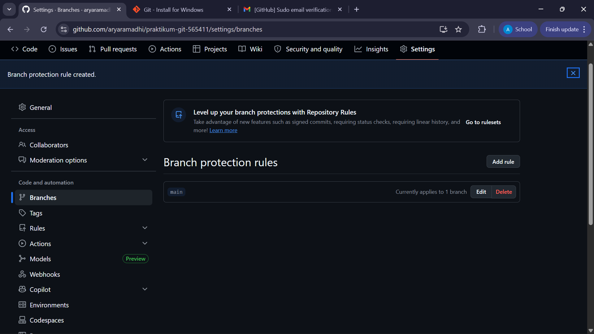

## Tugas 1

# praktikum-git-565411

## Tugas 2

## Tugas 3: Konflik & Rebase

### 1. Resolusi Konflik Manual
Saya membuat konflik antara branch `experiment/color-A` dan `experiment/color-B`. 
Konflik diselesaikan secara manual di VS Code dengan memilih warna yang diinginkan.

### 2. Interactive Rebase (Squash)
Saya menggunakan `git rebase -i` untuk merapikan riwayat commit pada branch `feature/dark-mode`. 
Tiga commit kecil digabungkan menjadi satu commit tunggal: `feat: implementasi mode gelap dan transisi yang lembut`.

## Bukti Proses Rebase:

## Tugas 4

# Proyek Praktikum Git Arya Ramadhi

## Deskripsi Project
Proyek ini adalah tugas praktikum untuk mempelajari alur kerja Git profesional, mulai dari manajemen branch hingga teknik rebase.

## Cara Menjalankan
1. Buka link berikut: `git clone [https://github.com/aryaramadhi/praktikum-git-565411]`

## Dokumentasi Perintah Git
* `git checkout -b [nama-branch]`: Membuat branch baru dan langsung berpindah ke sana.
* `git merge [nama-branch]`: Menggabungkan perubahan dari branch lain ke branch aktif.
* `git pull origin [nama-branch]`: Mengambil dan menggabungkan perubahan terbaru dari GitHub ke laptop.
* `git rebase -i HEAD~[jumlah]`: Melakukan interactive rebase untuk merapikan riwayat commit (squash).
* `git push origin [nama-branch] --force`: Memaksa pengiriman commit ke GitHub (digunakan setelah rebase).

## Hasil Tugas

### Dokumentasi Perintah Git (Tugas 4 tambahan)
* `git checkout -b [nama]`: Membuat branch baru dan berpindah ke sana.
* `git merge [nama]`: Menggabungkan branch.
* `git rebase -i`: Merapikan riwayat commit (squash).
* `git push --force`: Mengirim perubahan setelah rebase.